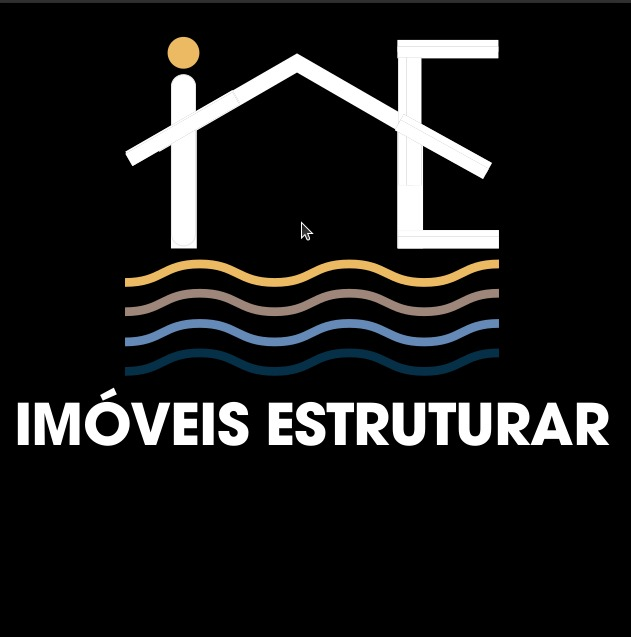

# Imóveis Estruturar - Landing Page



Uma landing page moderna e responsiva para Imóveis Estruturar, destacando terrenos e casas em Prado, Bahia.

## 🚀 Tecnologias Utilizadas

- **Next.js** (v13.5.6): Framework React para renderização do lado do servidor
- **React** (v18.2.0): Biblioteca JavaScript para construção de interfaces
- **TypeScript**: Tipagem estática para JavaScript
- **Tailwind CSS**: Framework CSS utilitário para design responsivo
- **Framer Motion**: Biblioteca de animações para React
- **Lucide React**: Conjunto de ícones leves e consistentes
- **React Intersection Observer**: Detecção de elementos visíveis na viewport
- **Radix UI**: Componentes de UI acessíveis e sem estilos
- **Headless UI**: Componentes de UI completamente estilizáveis

## 📋 Mapa do Site

- **Hero**: Seção principal com logo e chamada para ação
  - Navegação principal
  - Banner com imagem de fundo da praia
  - Logo em destaque
  - Texto principal e botões CTA

- **Features**: Diferenciais do empreendimento
  - Cards com ícones e descrições de 6 recursos principais
  - Animações de entrada

- **Gallery**: Galeria de imagens do empreendimento
  - Visualização em grid responsivo
  - Lightbox para ampliação de imagens
  - Animações de hover e transição

- **Location**: Mapa e localização estratégica
  - Google Maps integrado
  - Detalhes sobre a localização
  - Benefícios da região

- **Contact**: Formulário de contato e informações
  - Formulário para solicitação de informações
  - Links diretos para WhatsApp e telefone
  - Informações de contato da imobiliária

- **Footer**: Rodapé com informações adicionais
  - Links úteis
  - Redes sociais
  - Horário de funcionamento
  - Créditos

## 📦 Componentes

- **Hero.tsx**: Seção principal da página
- **Features.tsx**: Cards de diferenciais do empreendimento
- **Gallery.tsx**: Galeria de imagens com lightbox
- **Location.tsx**: Mapa e informações de localização
- **ContactForm.tsx**: Formulário de contato flutuante
- **WhatsAppButton.tsx**: Botão fixo de WhatsApp
- **BackToTop.tsx**: Botão para voltar ao topo
- **Loading.tsx**: Componente de carregamento

## 🛠️ Como Executar o Projeto

### Pré-requisitos

- Node.js (versão 14.x ou superior)
- npm ou yarn

### Instalação

1. Clone o repositório
   ```bash
   git clone https://github.com/kassio20/Xenia.git
   cd Xenia
   git checkout site-animado
   ```

2. Instale as dependências
   ```bash
   npm install
   # ou
   yarn install
   ```

3. Execute o ambiente de desenvolvimento
   ```bash
   npm run dev
   # ou
   yarn dev
   ```

4. Abra [http://localhost:3000](http://localhost:3000) no seu navegador para ver o resultado

### Construção para produção

```bash
npm run build
# ou
yarn build
```

### Executar versão de produção

```bash
npm run start
# ou
yarn start
```

## 📱 Responsividade

- Desktop (1280px+)
- Tablet (768px - 1279px)
- Celular (até 767px)

Todos os componentes são totalmente responsivos e adaptados para diferentes tamanhos de tela.

## 🎨 Personalização

O projeto utiliza variáveis CSS e Tailwind para fácil personalização:

- Cores principais definidas em `tailwind.config.js`
- Estilos de componentes em `globals.css`
- Informações de contato em `constants/contact.ts`

## 📄 Licença

Este projeto está sob a licença MIT. Veja o arquivo [LICENSE](LICENSE) para mais detalhes.

## 🙏 Créditos

Desenvolvido por KMM Soluções em Tecnologia.
